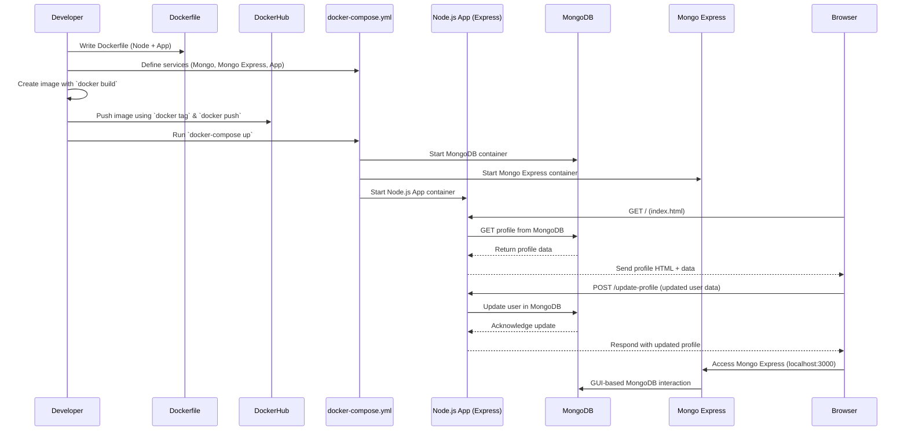

# Deploying a Node.js + MongoDB App with Docker Compose and Uploading to Docker Hub

This project showcases a simple yet complete full-stack setup using Node.js, MongoDB, and Docker. The application is designed to manage a user profile, allowing you to view and update user data through a clean HTML interface. On the backend, an Express server handles API requests and connects to a MongoDB database for persistent storage. The entire stack is containerized using Docker, with services defined in a `docker-compose.yml` file to streamline orchestration. Mongo Express is also included for easy database management through a web interface. In addition to running everything locally, this setup demonstrates how to build a Docker image of the Node.js application and push it to Docker Hub for distribution or deployment. Whether you're experimenting locally or preparing for production, this project provides a clear example of how to bring together key components in a modern, containerized development environment.




## 🛠️ Prerequisites

Before you begin, ensure you have the following tools installed on your local machine to build, run, and manage the Dockerized application:

<p align="left">
  
  
  
  
  
  
</p>

### Install links

- [Install Node.js and npm](https://nodejs.org/en/download/)
- [Install Docker](https://docs.docker.com/get-docker/)
- [Install Docker Compose](https://docs.docker.com/compose/install/)
- [Install MongoDB (optional, for local debugging)](https://www.mongodb.com/try/download/community)

### Step 1: Build and Start the Containers
```bash
docker-compose up --build
```

Check in Localhost:3000 through postman


### Step 2: login 

```bash
docker login
```


### Step 3: Build the Docker image
```bash
docker build -t yourdockerhubusername/node-profile-app .
```


### Step 4: Push to Docker Hub
```bash
docker push yourdockerhubusername/node-profile-app
```


### Step 5: Stop and Clean Up
```bash
docker-compose down
```


