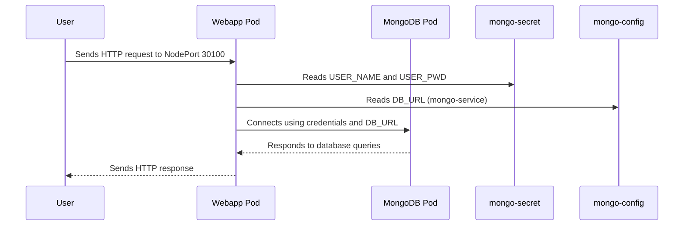

## Kubernetes Deployment: MongoDB + Web Application

The changes introduce a complete Kubernetes deployment setup for a MongoDB database and a web application. Four new YAML files are added: a ConfigMap for the MongoDB URL, a Secret for MongoDB credentials, a Deployment and Service for MongoDB, and a Deployment and NodePort Service for the web application. The web application is configured to receive its database credentials and URL from the newly created Secret and ConfigMap. The MongoDB deployment uses the Secret for secure environment variable injection, and both services are exposed internally, with the web application also accessible externally via a fixed node port.

| File(s)                    | Change Summary                                                                                           |
|----------------------------|---------------------------------------------------------------------------------------------------------|
| mongo-config.yaml          | Added ConfigMap `mongo-config` with `mongo-url: mongo-service` for MongoDB connection information.      |
| mongo-secret.yaml          | Added Secret `mongo-secret` with base64-encoded `mongo-user` and `mongo-password` for MongoDB access.   |
| mongo.yaml                 | Added MongoDB Deployment (`mongo-deployment`) and Service (`mongo-service`) using secrets for credentials.|
| webapp.yaml                | Added Webapp Deployment (`webapp-deployment`) and NodePort Service (`webapp-service`), sourcing env vars from secrets and config maps. |

## Sequence Diagram(s)



## Prerequisites

Before you begin, make sure you have the following tools installed on your local machine:

<p align="left">
  
  
  
  
  
</p>

### Install links :)

- [Install Minikube](https://minikube.sigs.k8s.io/docs/start/)
- [Install kubectl](https://kubernetes.io/docs/tasks/tools/)
- [Install Docker](https://docs.docker.com/get-docker/)


## Set Up 
Follow these commands step-by-step to get your **MongoDB + WebApp** deployed using **Kubernetes + Minikube**.


### Step 1: Start Minikube

```bash
minikube start
```
### Step 2: Apply all files

```bash
kubectl apply -f mongo-config.yaml
kubectl apply -f mongo-secret.yaml
kubectl apply -f mongo.yaml
kubectl apply -f mongo.yaml
```


### Step 3: Check Deployment Status 
```bash
kubectl get all
kubectl get pods
kubectl get services
kubectl get configmap
kubectl get secrets
```
If you encounter any errors or an image pull error, please ensure that you have pushed the image to Docker Hub and also check the webapp.yaml file.

### Step 4: Find NodePort & IP
```bash
kubectl get svc
minikube ip
```

### Step 5: Dashboard 

(Check if all containers are running and if there are any errors.)
```bash
minikube dashboard
```


### Step 6: Access the Web App
```
minikube service webapp-service
```


<br>


