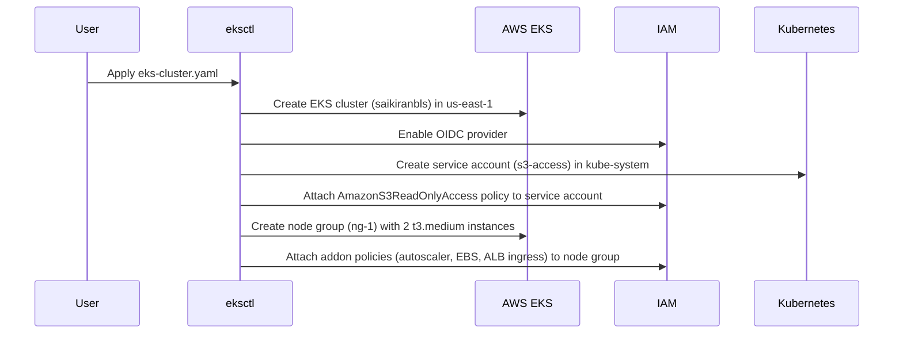
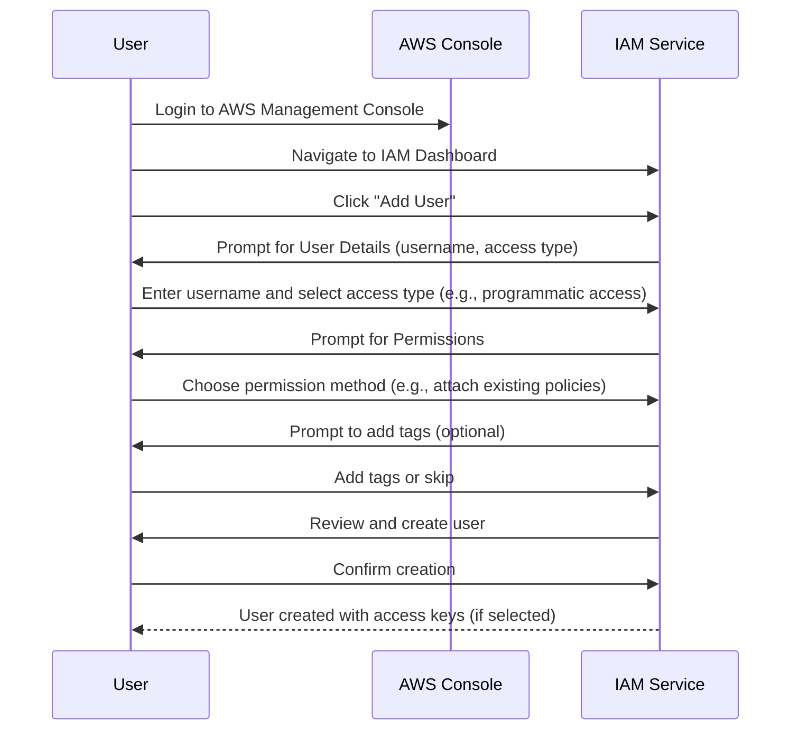

# Amazon EKS Cluster Setup using `eksctl`


A new EKS cluster configuration file, `eks-cluster.yaml`, has been added. This file specifies the setup for an Amazon EKS cluster named "sai_kiran_bls" in the "us-east-1" region, using the eksctl format version v1alpha5. The configuration includes enabling IAM OIDC provider integration, defining a Kubernetes service account with S3 read-only access, and creating a node group with two t3.medium EC2 instances. IAM addon policies for autoscaler, EBS, and ALB ingress controller support are also specified.

## Changes

| File(s)                         | Change Summary                                                                                         |
|----------------------------------|-------------------------------------------------------------------------------------------------------|
| Day 3/eks-cluster.yaml           | Added new EKS cluster configuration with metadata, IAM OIDC, service account for S3 access, and node group setup. |

## Sequence Diagram(s)



## Prerequisites

Before you begin, make sure the following tools are installed on your system:

<p align="left">
  
  
  
  
</p>

---

### Install Links

- 📦 [Install AWS CLI](https://docs.aws.amazon.com/cli/latest/userguide/install-cliv2.html)
- ⚙️ [Install eksctl](https://docs.aws.amazon.com/eks/latest/userguide/eksctl.html)
- 🔧 [Install Git](https://git-scm.com/downloads)
---

## 🔐 IAM User Creation – Sequence Diagram




## 🔐 Creating IAM User for EKS Cluster Setup

To create an EKS cluster using `eksctl`, you need an IAM user with sufficient permissions.

### ✅ Step-by-Step Instructions

1. **Login to AWS Console**
2. **Go to IAM → Users**
3. **Click "Add user"**
   - Username: `eks-admin` (or any name)
   - Access Type: ✅ Programmatic access
4. **Set Permissions**
   - Choose: **Attach existing policies directly**
   - Attach the following AWS-managed policies:
     - `AmazonEKSClusterPolicy`
     - `AmazonEKSWorkerNodePolicy`
     - `AmazonEC2FullAccess`
     - `IAMFullAccess`
     - `AmazonVPCFullAccess`


5. **Review and Create User**
6. **Download the Access Key and Secret Key**
7. **✅ Verify AWS CLI Configuration**
   - Check if AWS CLI is installed:
     ```bash
     aws --version
     ```
   - Configure AWS CLI with your credentials:
     ```bash
     aws configure
     ```
     > Enter your **Access Key**, **Secret Key**, **Region** (e.g., `us-east-1`), and **output format** (e.g., `json`).

   - Verify your identity:
     ```bash
     aws sts get-caller-identity
     ```
  

---

### 🧾 Required IAM Policies

You can also create a custom policy with all the necessary permissions:

<details>
<summary>Click to view inline policy</summary>

```json
{
  "Version": "2012-10-17",
  "Statement": [
    {
      "Effect": "Allow",
      "Action": [
        "eks:*",
        "ec2:*",
        "iam:*",
        "cloudformation:*",
        "vpc:*",
        "autoscaling:*"
      ],
      "Resource": "*"
    }
  ]
}
```
</details>


## 🚀 Creating EKS Cluster Through YAML File

To create an EKS cluster, you can use an `eks-cluster.yaml` file with the `eksctl` tool. Here's how you can proceed.

### Step 1: Ensure you have `eksctl` installed

Before creating the cluster, make sure you have `eksctl` installed. You can check if it's installed by running and also execute the yaml file: 

```bash
eksctl version
eksctl create cluster -f eks-cluster.yaml
```


## Alternative: Create Cluster Directly Through CLI

If you prefer creating the cluster directly via the CLI, you can use the following commands.

### Step 1: Run the EKS Create Command

Here’s the command to create the cluster:

```bash
eksctl create cluster --name sai-kiran-bls --region us-east-1 --nodegroup-name ng-1 --node-type t3.medium --nodes 2 --nodes-min 1 --nodes-max 3 --ssh-access --ssh-public-key your-ssh-key-name
```
<br>


