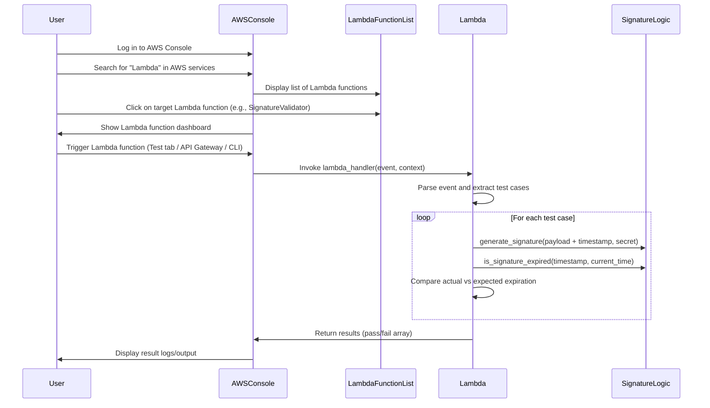

## Signature Expiration Validator - AWS Lambda Function

A new AWS Lambda function was introduced to process and validate HMAC-SHA256 signatures with expiration logic. The function takes a list of test cases, each specifying payload, timestamp, current time, and expected expiration status. It generates signatures, checks if they are expired based on a 5-minute window, and returns results indicating whether each test case passes or fails. Additionally, a JSON file was added containing structured test cases for signature expiration validation, covering various scenarios including valid, expired, boundary, and skewed timestamps.

## Changes

| File(s)                                         | Change Summary                                                                                      |
|-------------------------------------------------|-----------------------------------------------------------------------------------------------------|
| lambda_function.py                        | Added a Lambda function to process test cases for signature expiration validation, including helpers for signature generation and expiration checking. |
| event.json                                | Added a JSON file containing an array of test cases for signature expiration, each with relevant fields for validation. |

## Sequence Diagram(s)

## Prerequisites ;)

Before you begin, make sure the following tools are installed on your system:

  
  
  
  

---

### Required

| Tool        | Description                                  | Install Link                                                                 |
|-------------|----------------------------------------------|------------------------------------------------------------------------------|
| AWS CLI     | For deploying and managing AWS services      | [Install AWS CLI](https://docs.aws.amazon.com/cli/latest/userguide/install-cliv2.html) |
| Python 3.8+ | To run/test the Lambda function locally       | [Download Python](https://www.python.org/downloads/)                         |
| Git         | For version control and cloning repos        | [Install Git](https://git-scm.com/downloads)                                 |
| AWS Account | To access AWS Lambda Console & Cloud Services| [Sign Up for AWS](https://aws.amazon.com/free/)                              |

---

### IAM Permissions

Make sure your user or role has the following permissions:

- `AWSLambda_FullAccess`
- `CloudWatchLogsFullAccess`

## How to Use this Lambda Function

### Step-by-Step Guide (AWS Console)

1. **Login to AWS Console**
   - Go to [https://console.aws.amazon.com](https://console.aws.amazon.com)

2. **Search for "Lambda"**
   - In the top search bar, type `"Lambda"` and select the **Lambda service**.

3. **Select Your Lambda Function**
   - Click on the name of your deployed Lambda function (e.g., `SignatureValidatorFunction`).

4. **Upload the Code**
   - Use the AWS Console editor or upload a `.zip` containing:
     - `lambda_function.py`
     - `event.json` (optional for testing)

5. **Configure a Test Event**
   - Go to the **Test tab**.
   - Create a new test event using the `event.json` structure provided below.

6. **Run the Function**
   - Click **"Test"** to invoke the function.
   - View the results in the **Logs/Output section**.

## Lambda Function Logic (`lambda_function.py`)

### For each test case:
1. **Input**:  
   - `payload`: The data used in the signature.
   - `timestamp`: Time the signature was generated.
   - `current_time`: Simulated "now" to check expiration.
   - `expected_expired`: Boolean flag indicating expected result.
  
    

2. **Signature Generation**:
   - Combines `payload + timestamp` as the message.
   - Uses a **secret key** to generate an HMAC-SHA256 signature.

3. **Expiration Check**:
   - Compares the `timestamp` with `current_time`.
   - If the timestamp is more than **5 minutes older**, it's expired.

4. **Validation**:
   - Compares actual expiration status with `expected_expired`.
   - Appends result (`pass` or `fail`) to the final output.

5. **Returns**:
   - A JSON object listing the result of each test case.

   

   

   

