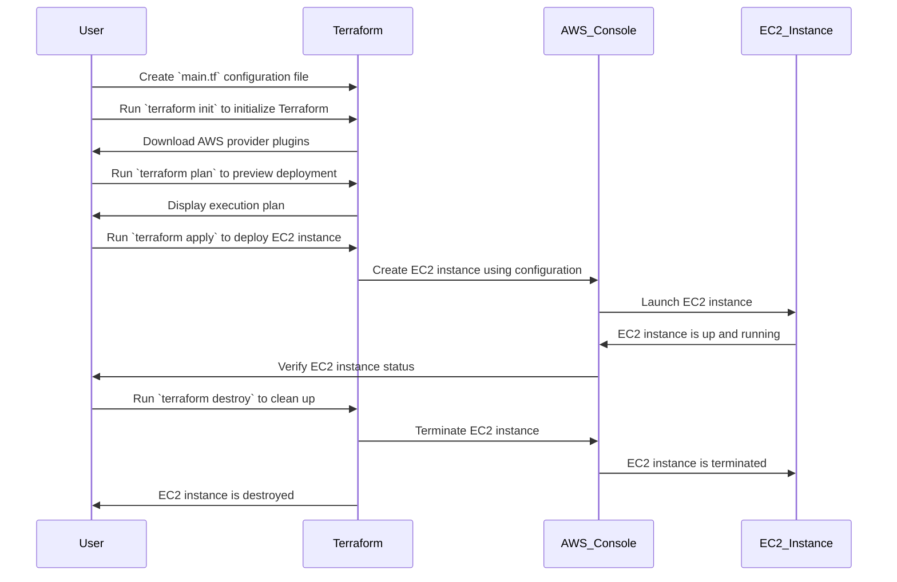

# 🚀 Deploy EC2 Instance Using Terraform

This guide helps you to deploy an AWS EC2 instance using Terraform.



---

## 🧱 Prerequisites

Before you begin, make sure the following tools are installed on your system:

<p align="left">
  
  
</p>

### 📦 Install Terraform

- [Download Terraform](https://www.terraform.io/downloads.html)

### 📦 Install AWS CLI

- [Install AWS CLI](https://docs.aws.amazon.com/cli/latest/userguide/install-cliv2.html)

---

## Configure AWS CLI

1. Open your terminal.
2. Run the following command to configure AWS CLI with your AWS credentials:

```bash
aws configure
```

Note: (Sync the time)


## Terraform Commands 
```bash
terraform init
terraform plan
terraform apply
```


