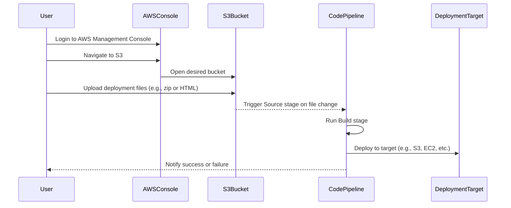

# AWS Deployment Guide: S3 Upload & CodePipeline Setup

This guide walks you through the process of uploading files to an S3 bucket and triggering a deployment through AWS CodePipeline.

---

## Prerequisites

  
  
  

- AWS CLI installed and configured (`aws configure`)
- S3 bucket already created
- CodePipeline already configured to trigger on S3 changes

---

## Step 1: Upload File to S3 Bucket

1. Go to the **AWS Console**.
2. Navigate to the **S3** service.
3. Choose the desired **S3 bucket**.
4. Click **Upload**, then drag and drop your build/deployment files (e.g. `build.zip` or `index.html`).
5. Click **Upload**.

Screenshot:

 

---

## Step 2: Trigger CodePipeline

If your pipeline is configured to detect changes in the S3 bucket:

1. Once the file is uploaded, go to **CodePipeline** in AWS Console.
2. Select your pipeline.
3. It should start automatically. If not, click **"Release Change"** manually.

Screenshot:

---

## Success Criteria

- Files uploaded to correct S3 bucket
- Pipeline automatically or manually triggered
- All stages (Source → Build → Deploy) pass successfully

---

## Notes

- Ensure your S3 bucket has proper triggers configured in the **CodePipeline source stage**.
- For large files, compress them before uploading.
- Check **CloudWatch Logs** if the pipeline fails.

---

